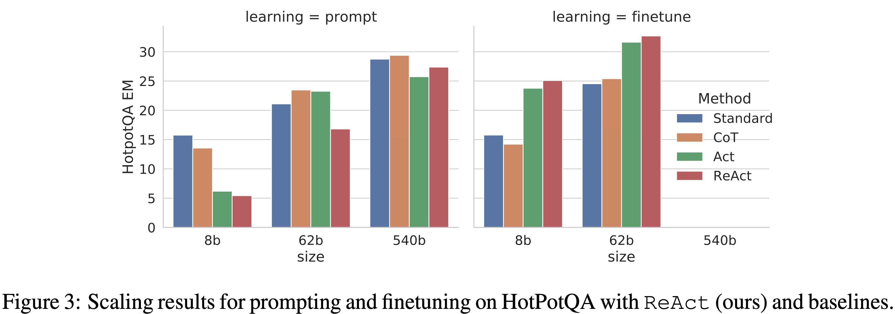
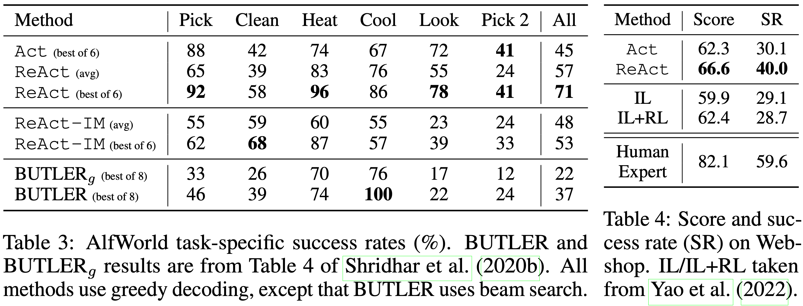

> [Paper](https://arxiv.org/abs/2210.03629)

## Agent Work Setup

 - Observation，观察到的环境和可用信息
 - Action，可执行行为
 - Context，上下文窗口
  
    **Action Space**：Action Space 指 agent 能对外部环境执行、并会改变环境或得到反馈的动作集合，这些动作执行后，环境会返回 observation。

    **Language Space**：Language Space 指自由自然语言生成空间，在 ReAct 里，它不是“对外动作”，而是 agent 写给自己看的 thought / reasoning trace

## Motivation

当前的研究工作没有将agent的推理和行动结合起来完成目标任务，大都是仅用推理或者仅用行动来完成任务的。

ReAct提出一种一般范式，将LLM的推理和行动过程结合起来，以推理——行动——推理···这样互相交错的方式来达成目标，模型可以动态执行推理、调整行动规划和获取外部信息

## ReAct：Synergizing Reasoning & Acting

1. 表1中可以看出 ReAct+CoT 性能最好
   
   ReAct在HotpotQA和Fever两个benchmark上的性能均优于Act；在HotpotQA上弱于CoT，而在Fever上更优。这说明通过获取外部的正确信息来指导Agent行动能够切实提升Agent的任务性能；而CoT+ReAct的组合成功融合了两种范式的优点，取得了最好的性能。其作用机制是当第一种范式没有得到确定的答案时，用另一种范式来进行：
   
   （1）当CoT多数投票不够一致，说明模型内部知识可能不可靠，就切换到 ReAct，通过外部搜索/观察来补充事实，用ReAct为CoT兜底
   
   （2）如果 ReAct 在限定步数内没有得到答案，就退回 CoT-SC，用CoT为ReAct兜底
   
   从表1中可以看出，CoT-SC -> ReAct在两个benchmark上的性能均优于CoT-SC，说明在CoT推理得到的答案不确定时，通过ReAct获取外部信息能够有效指导Agent完成目标任务；而ReAct -> CoT-SC在两个benchmark上的性能也均优于ReAct，

2. CoT范式的幻觉现象严重

ReAcT范式虽然能够基于外部信息来推理答案，但是这样的思考过程限制了它的推理能力，没有CoT的推理能力强

对于ReAcT来说，通过搜索来获取正确的信息丰富的知识十分重要

> 为什么获取正确的外部信息很重要？没有这一步是不是就退化到CoT这样的范式？
>
> 获取正确的外部信息固然重要，ReAct需要依据外部的信息来调整未来的行动和规划。如果去掉外部信息获取和观察执行阶段，ReAct基本上就退化为CoT的推理范式。

